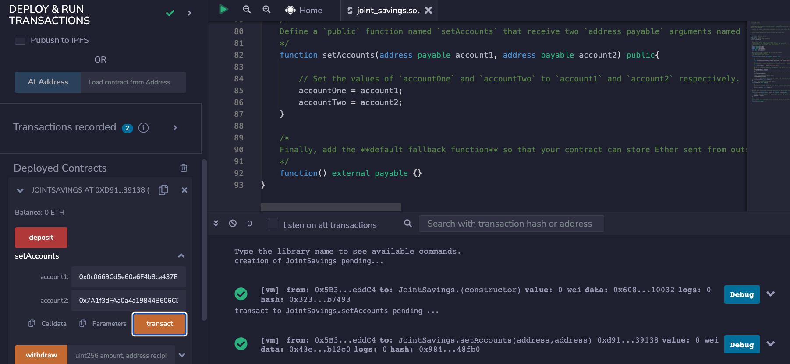
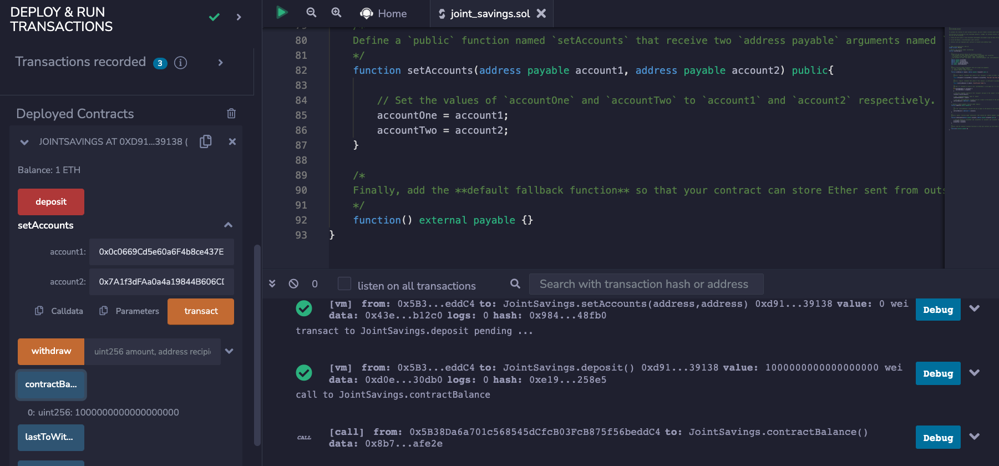
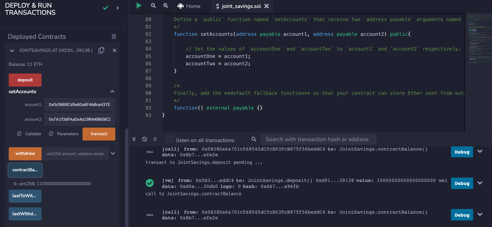
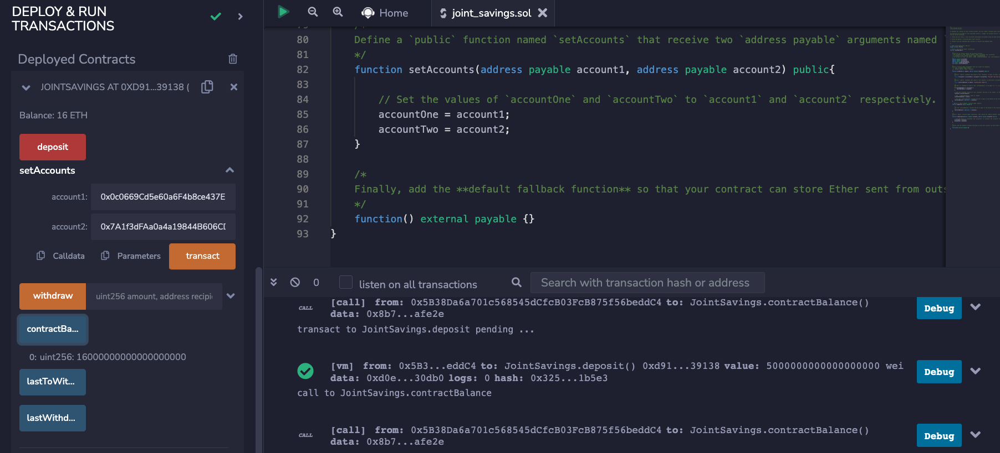

# Joint Savings Account

## Requirements

* Remix - Ethereum IDE
  * `solidity ^0.5.0`

## Purpose of Use

Create a Solidity smart contract to automate financial processes and features, such as hosting joint savings accounts. This smart contract accepts two user addresses that control a joint savings account. It uses ether management functions to implement a financial institution’s requirements for providing the features of the joint savings account. These features consist of the ability to deposit and withdraw funds from the account.

## Files Navigation

* `Execution_Results`: Directory containing screenshots of contract executions
* `joint_savings.sol`: Solidity file that contains the completed smart contract

## Solutions/Summary

* Create a joint savings account contract in Solidity
* Compile and deploy the contract in the Remix VM (London)
* Interact with the deployed Smart contract
  * Define the authorized Ethereum addresses

  * Send 1 ether as wei

  * Send 10 ether as wei

  * Send 5 ether

  * Withdraw 5 ether into `accountOne`

  * Withdraw 10 ether into `accountTwo`
